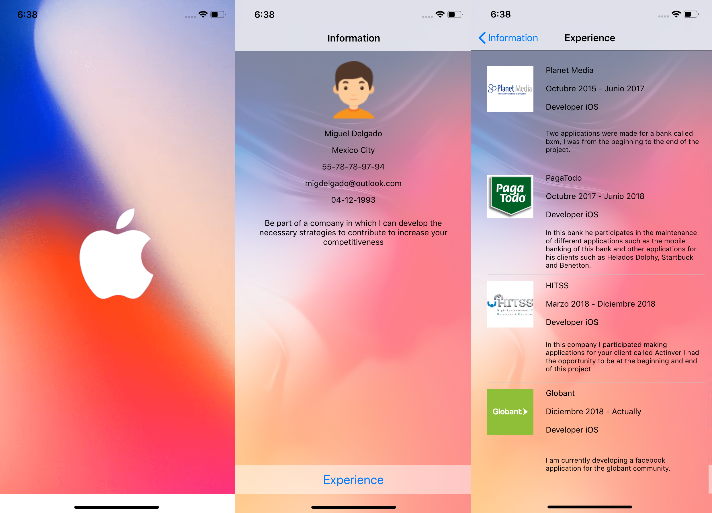

# Curriculum Vitae

The purpose of develop this app was complete a code challenge. This app shows [Globant5] resume andmy iOS developer experience.

Taken list-detail flow as flow base, I show a short summary about me and my iOS developer career. At the first view you might see my personal information and some ways put on contact with me.

## Summary

+ Swift version: __4.2__
+ iOS development target: __12.1__
+ Architecture: Model View Present (__MVP__)
+ Resources:
    + Information: [JSON](https://gist.github.com/MiguelDelgado22/47dad348488891b1d5fba23b41b25b04)
    + Public images:
    + [Planet media](https://i.imgur.com/aSCJmX6.png)
    + [Paga todo](https://i.imgur.com/wVcW6jA.png)
    + [HITSS](https://i.imgur.com/W4Xpip2.jpg)
    + [Globant](https://i.imgur.com/YbGV5B4.png)

## Testing

+ Unit Test
    + The networking test use a mocking session
    + Test decode information from a json file valid and invalid
    + Test URLSession using mocks
    + Test presenter of the views
    
+ UI Test
    + A simple test of the app funcionality
    + Test correct load of the data at view

## Screenshots

